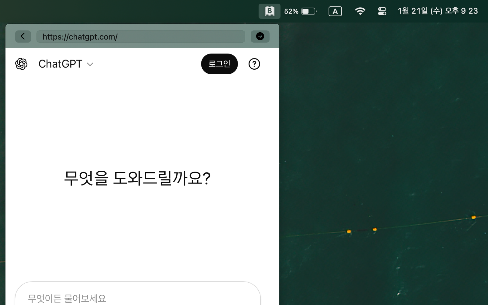
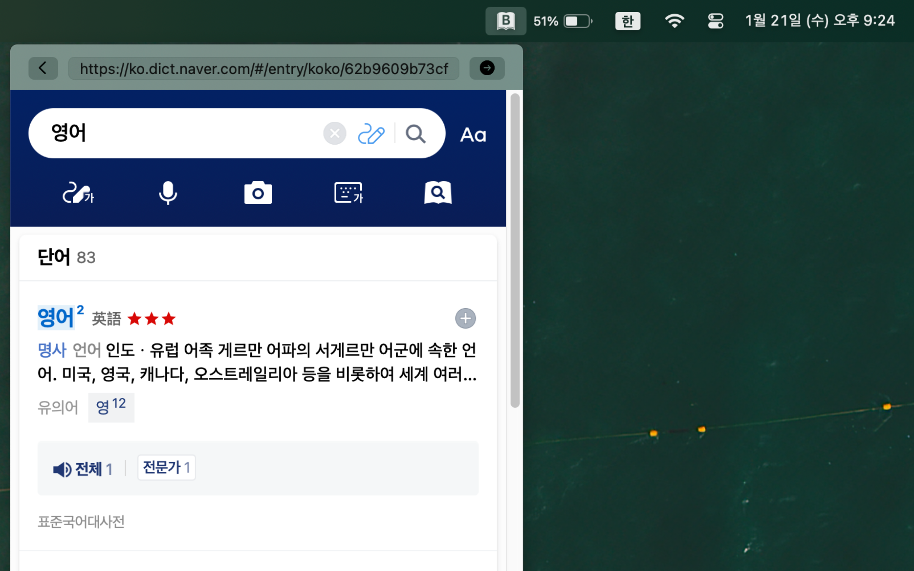
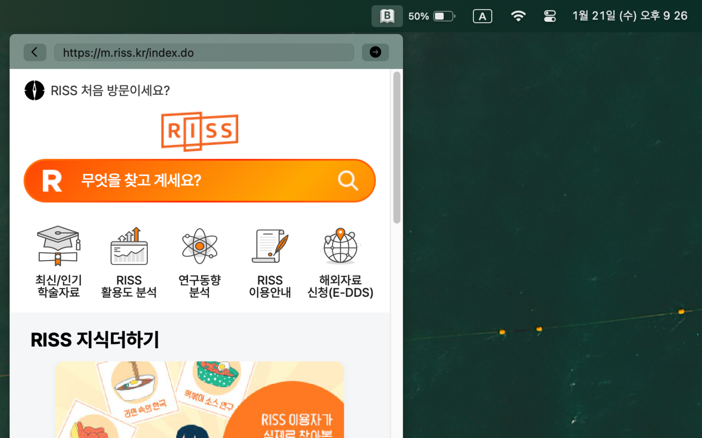

# Bar Browser (바브라우저)
맥os 상태바에 간단한 웹브라우저

## 프리뷰

  
  
  

## 앱 설명
메뉴바에서 바로 사용하는 새로운 웹 브라우저 경험
별도의 창 전환 없이, 필요한 순간에 바로 웹을 확인하세요.

이 앱은 메뉴바 영역에서 웹사이트를 볼 수 있는 미니 웹브라우저입니다.
클릭 한 번으로 사전, 성경, 검색 페이지를 빠르게 열 수 있습니다.

앱을 종료해도 걱정하지 마세요.
마지막에 보던 웹사이트를 자동으로 기억하여 시작 페이지로 다시 보여줍니다.

문서 작업 중 단어 뜻이 궁금할 때
논문이나 글을 쓰다 참고 자료가 필요할 때
코딩이나 편집 작업 중 간단한 검색이 필요할 때

모든 작업 흐름을 끊지 않고
메뉴바 안에서 빠르게 확인할 수 있습니다.

복잡한 기능은 과감히 제거했습니다.
정말 필요한 기능만 담은 심플한 미니 브라우저입니다.

가볍고 빠르게 동작하며
항상 손이 닿는 메뉴바에 조용히 머뭅니다.

웹서핑을 더 효율적으로,
작업은 더 집중할 수 있도록.

작지만 강력한 메뉴바 속 브라우저를 경험해보세요.

## 라이선스
바브라우저는 MIT 라이센스 하에 배포됩니다.
